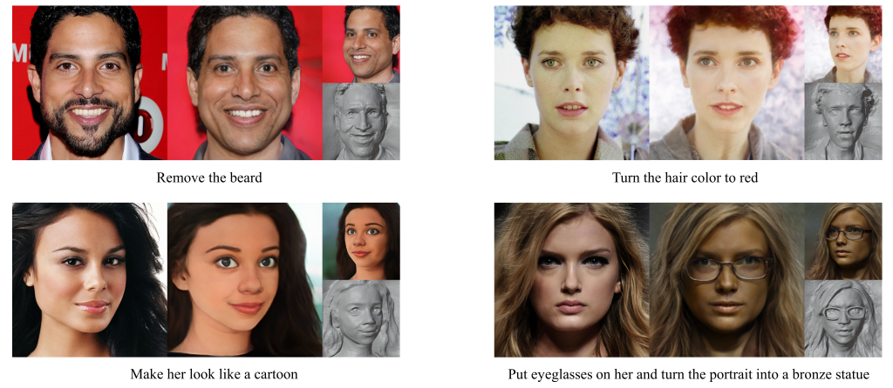
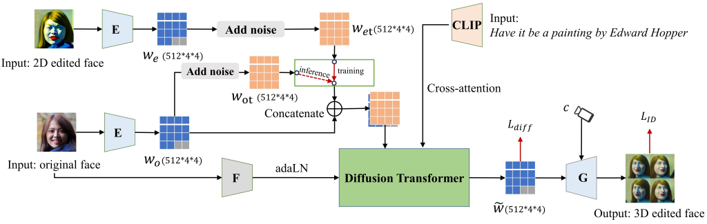
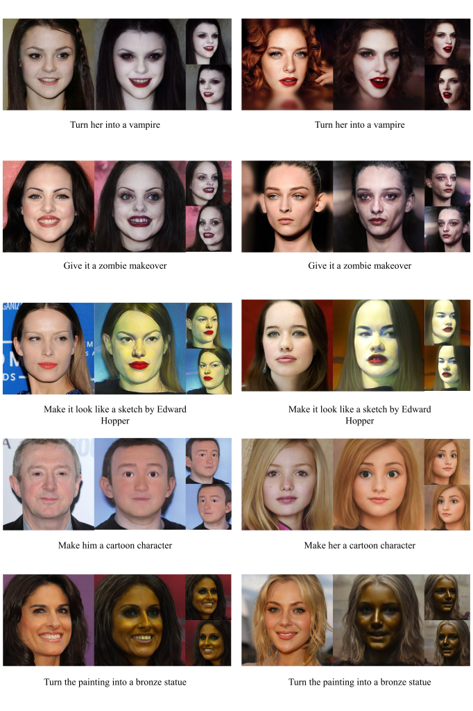
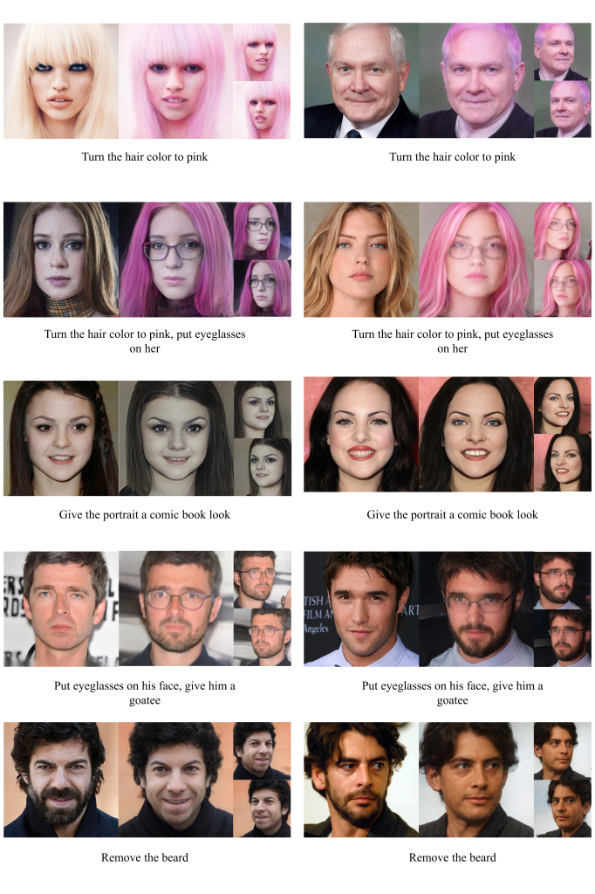

# InstructPix2NeRF: Instructed 3D Portrait Editing from a Single Image (ICLR 2024)
[paper](https://arxiv.org/abs/2311.02826) | [project page](https://mybabyyh.github.io/Preim3D/) 

> With the success of Neural Radiance Field (NeRF) in 3D-aware portrait editing, a variety of works have achieved promising results regarding both quality and 3D consistency. However, these methods heavily rely on per-prompt optimization when handling natural language as editing instructions. Due to the lack of labeled human face 3D datasets and effective architectures, the area of human-instructed 3D-aware editing for open-world portraits in an end-to-end manner remains under-explored.
To solve this problem, we propose an end-to-end diffusion-based framework termed $\textbf{InstructPix2NeRF}$, which enables instructed 3D-aware portrait editing from a single open-world image with human instructions. At its core lies a conditional latent 3D diffusion process that lifts 2D editing to 3D space by learning the correlation between the paired images' difference and the instructions via triplet data. With the help of our proposed token position randomization strategy, we could even achieve multi-semantic editing through one single pass with the portrait identity well-preserved. Besides, we further propose an identity consistency module that directly modulates the extracted identity signals into our diffusion process, which increases the multi-view 3D identity consistency. Extensive experiments verify the effectiveness of our method and show its superiority against strong baselines quantitatively and qualitatively.

<p align="center">

</p>

## Description   
Official Implementation of "<a href="https://arxiv.org/abs/2311.02826">InstructPix2NeRF: Instructed 3D Portrait Editing from a Single Image</a>" paper. 
The InstructPix2NeRF enables precise 3D-aware portrait editing from a single image guided by human instructions.

## Introduction
we propose a pipeline that enables precise 3D-aware portrait editing from a single image guided by human instructions, termed InstructPix2NeRF. 

 

## Getting Started
### Environment
The environment can be set up as follows:
```
conda create -n ip2n python=3.10

conda install pytorch==2.1.0 torchvision==0.16.0 torchaudio==2.1.0 pytorch-cuda=12.1 -c pytorch -c nvidia

pip install -r requirements.txt
```

### Pretrained Models
Please download our pre-trained models from the following links and put it in `./pretrained`.
| Path | Description
| :--- | :----------
|[InstructPix2NeRF](https://pan.quark.cn/s/020e7faf53e9)  | A conditional latent 3D diffusion model.

We also provide other models needed for inference and training and put it in ./pretrained.
| Path | Description
| :--- | :----------
|[EG3D Generator](https://pan.quark.cn/s/7c5f2e04866c) | EG3D generator model pretrained on FFHQ taken from [EG3D](https://github.com/NVlabs/eg3d) with 512x512 output resolution.
|[PREIM3D FFHQ](https://pan.quark.cn/s/5fb75d9f22ca) | A finetuned PREIM3D FFHQ encoder.
|[model_ir_se50](https://pan.quark.cn/s/51801e294b38) | Pretrained IR-SE50 model taken from [TreB1eN](https://github.com/TreB1eN/InsightFace_Pytorch) for use in our ID feature.

## Inference
### Prepare Images

You can process your own dataset following EG3D. See [EG3D](https://github.com/NVlabs/eg3d) for alignment details.

We put some test images in `./data/test`, and you can quickly try them.  
### Script
You can use `inference.sh` to apply the model on a set of images.   
```
./inference.sh
```
### Interactive visualization
We provide a web demo for interactive editing tool. To start it, run:

```
python web_demo.py
```

## More results
 
 

## Acknowledgments
Thanks to [Peebles](https://github.com/facebookresearch/DiT) for sharing their code.

## Citation
If you use this code for your research, please cite:

```
@article{li2023instructpix2nerf,
  title={InstructPix2NeRF: Instructed 3D Portrait Editing from a Single Image},
  author={Li, Jianhui and Liu, Shilong and Liu, Zidong and Wang, Yikai and Zheng, Kaiwen and Xu, Jinghui and Li, Jianmin and Zhu, Jun},
  journal={arXiv preprint arXiv:2311.02826},
  year={2023}
}
```
